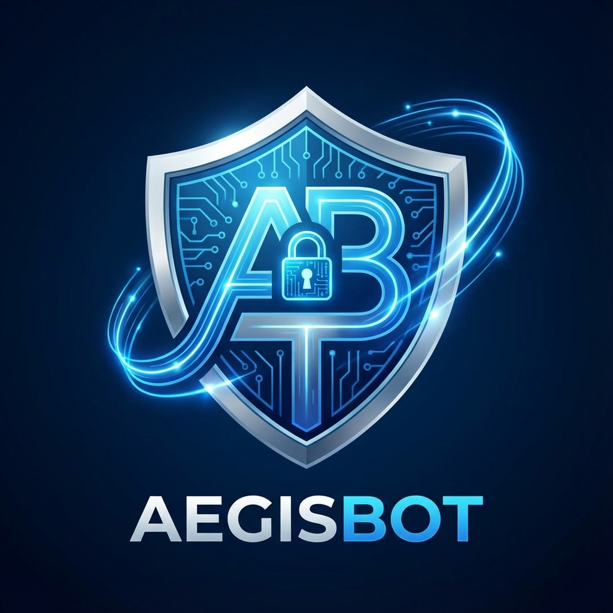

# AegisBot



[](https://my.home-assistant.io/redirect/supervisor_addon/?addon=c1e285b7_AegisBot)
[](https://www.home-assistant.io/addons/)
[](https://github.com/FaserF/hassio-addons/releases)


> Production-ready Telegram Moderation Bot with AI-driven FAQ and Security Features

---

## 📖 About


Production-ready Telegram Moderation Bot with AI-driven FAQ and Security Features.

## Features

- 🛡️ **Advanced Moderation**: Automated warning, kick, and block system with RBAC
- 🧠 **AI Intent Analysis**: Heuristic engine detecting scams and malicious intent
- 🔄 **Real-time Dashboard**: WebSocket-driven live event stream
- 📈 **Sophisticated Analytics**: Interactive security trends and visualizations
- 🌍 **Full i18n**: Multi-language support (EN/DE)
- 🚫 **Intelligent Filtering**: Auto-learning blacklist suggestions

## Installation

See the [Documentation](DOCS.md) for detailed installation instructions.

## Quick Start

1. Add this repository to Home Assistant
1. Install the AegisBot add-on
1. Configure your Telegram Bot Token
1. Start the add-on
1. Access via Ingress

---

## ⚙️ Configuration

Configure the add-on via the **Configuration** tab in the Home Assistant add-on page.

### Options

```yaml
database:
  type: sqlite
debug: false
demo_mode: false
demo_mode_type: ephemeral
developer_mode: false
github_repo: FaserF/AegisBot
github_token: ''
log_level: info
project_name: AegisBot
reset_database: false
secret_key: ''
version: latest
```

---

## 👨‍💻 Credits & License

This project is open-source and available under the MIT License.
Maintained by **FaserF**.
