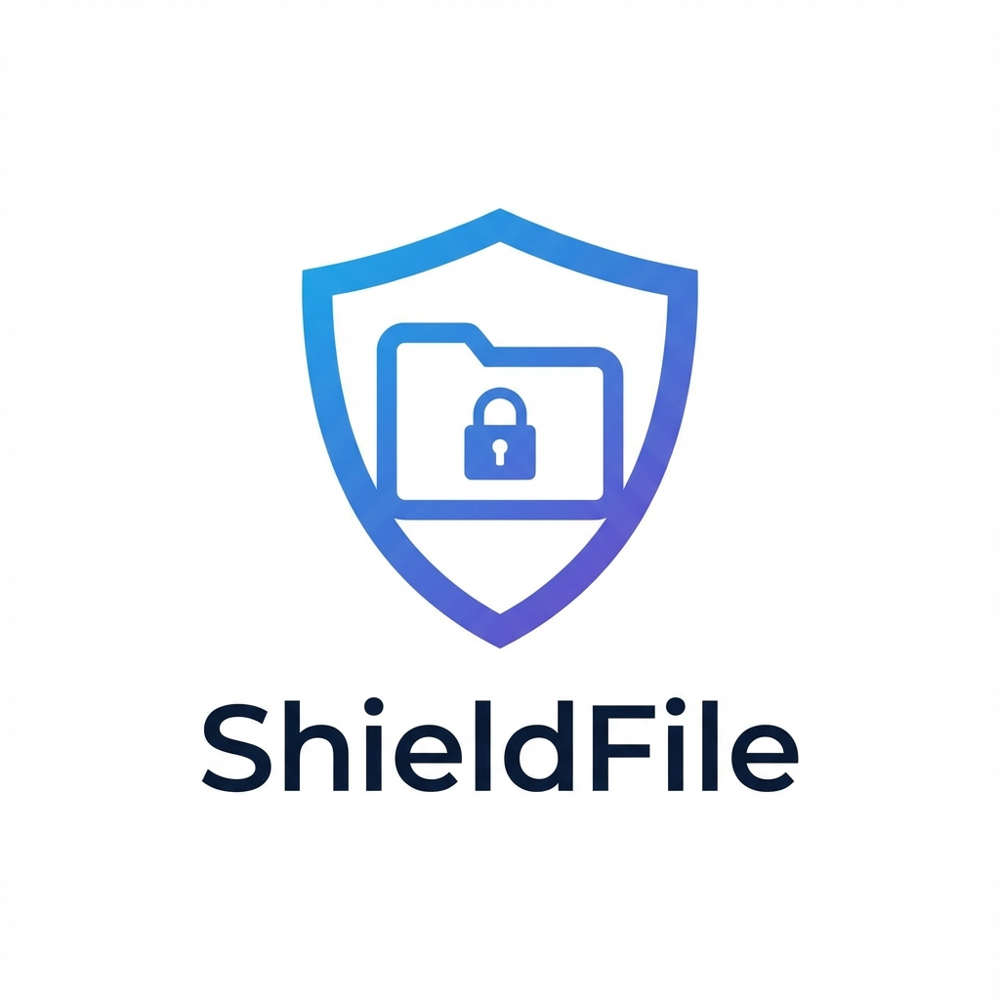

# ShieldFile



[](https://my.home-assistant.io/redirect/supervisor_addon/?addon=c1e285b7_ShieldFile)
[](https://www.home-assistant.io/addons/)
[](https://github.com/FaserF/hassio-addons/releases)


> Secure, Web-based File Manager (SFTP over HTTPS)

---

## 📖 About

## Secure, Web-based File Manager (SFTP over HTTPS)

Main Project: [ShieldFile](https://github.com/FaserF/ShieldFile)

ShieldFile provides a modern, fast, and secure way to manage files on your
Home Assistant host (e.g. `/share`, `/media`, `/config`).

> **Powered by [Filebrowser](https://filebrowser.org/)** ❤️
> ShieldFile wraps the amazing Filebrowser project in a "Secure-by-Default"
> container optimized for Home Assistant.

<!-- markdownlint-disable MD013 MD026 -->

## ❓ Why "ShieldFile" instead of plain Filebrowser

<!-- markdownlint-enable MD026 -->

ShieldFile is designed specifically for **Home Assistant** and **Security**:

1. **🔐 Secure Defaults**: ShieldFile enforces HTTPS. It automatically generates
   self-signed certificates if you don't have your own, ensuring your file
   transfers are never cleartext.
1. **🏠 HA Integration**: It pre-mounts your critical Home Assistant folders
   (`/config`, `/media`, `/share`, `/backup`) so you can manage them instantly.
1. **🛡️ Identity**: It fits perfectly into the "Shield" ecosystem (like
   ShieldDNS), providing a consistent, branded experience for your private cloud.

## 🤝 Compatibility

ShieldFile works perfectly alongside other official and community add-ons:

- **Advanced SSH & Web Terminal**: You can manage files via the
  command line while using ShieldFile for a visual interface. Both access the same
  `/share`, `/config`, etc. directories.
- **FTP**: You can use an FTP client to transfer bulk files and use ShieldFile to
  manage them from a browser.

## Features

- **HTTPS**: Secure file transfer via browser.
- **Configurable**: Choose which directory to serve.
- **Multi-User**: Define primary users in `config.yaml`, manage robust permissions
  in the UI.
- **Host Network**: High-performance direct binding.

## Installation

1. Install this repository in the Add-on Store.
1. Install **ShieldFile**.
1. Configure the options.
1. Start!

---

## ⚙️ Configuration

Configure the add-on via the **Configuration** tab in the Home Assistant add-on page.

### Options

```yaml
base_directory: /share
certfile: fullchain.pem
keyfile: privkey.pem
log_level: info
port: 8443
users:
  - password: changeme
    username: admin
```

---

## 👨‍💻 Credits & License

This project is open-source and available under the MIT License.
Maintained by **FaserF**.
