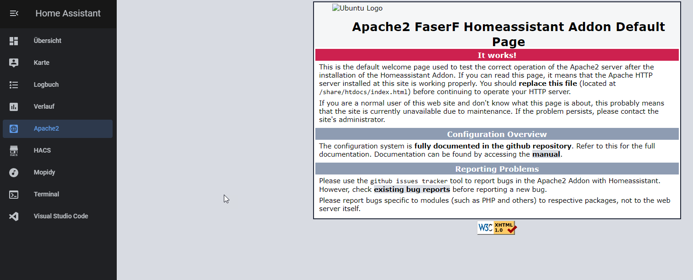

# Home Assistant Community Add-on: Apache2
![Supports aarch64 Architecture][aarch64-shield] ![Supports amd64 Architecture][amd64-shield] ![Supports armhf Architecture][armhf-shield] ![Supports armv7 Architecture][armv7-shield] ![Supports i386 Architecture][i386-shield]
![Project Maintenance][maintenance-shield]

Apache2 Webserver for Homeassistant OS



## About

The Apache HTTP Server Project is an effort to develop and maintain an open-source HTTP server for modern operating systems including UNIX and Windows. The goal of this project is to provide a secure, efficient and extensible server that provides HTTP services in sync with the current HTTP standards.<br />
The Apache HTTP Server ("httpd") was launched in 1995 and it has been the most popular web server on the Internet since April 1996. It has celebrated its 25th birthday as a project in February 2020.<br />
The Apache HTTP Server is a project of The Apache Software Foundation.


## Different Versions

### Full Version
The [full Apache2 Version](https://github.com/FaserF/hassio-addons/tree/master/apache2) with MariaDB and common used PHP 8 modules. <br />
This docker image comes with: apache2 php84-apache2 libxml2-dev apache2-utils apache2-mod-wsgi apache2-ssl mariadb-client ffmpeg<br />
The following php84 extensions will be installed: php84 php84-dev php84-fpm php84-mysqli php84-opcache php84-gd zlib php84-curl php84-phar php84-mbstring php84-zip php84-pdo php84-pdo_mysql php84-iconv php84-dom php84-session php84-intl php84-soap php84-fileinfo php84-xml php84-ctype php84-pecl-xdebug php84-pdo_sqlite php84-tokenizer php84-exif php84-xmlwriter php84-cgi php84-simplexml php84-gd php84-json php84-imap php84-apcu php84-simplexml<br />
Mosquitto & Mosquitto Dev<br />
And it comes with php locales.

### Minimal Version
The [Minimal Version](https://github.com/FaserF/hassio-addons/tree/master/apache2-minimal) of the Apache2 Addon without MariaDB and with no PHP modules. <br />
This docker image comes with: apache2 libxml2-dev apache2-utils apache2-mod-wsgi apache2-ssl

### Minimal Version with MariaDB
The [Minimal Version with MariaDB and some PHP modules](https://github.com/FaserF/hassio-addons/tree/master/apache2-minimal-mariadb) of the Apache2 Addon. <br />
This docker image comes with: apache2 php84-apache2 libxml2-dev apache2-utils apache2-mod-wsgi apache2-ssl mariadb-client<br />
The following php84 extensions will be installed: php84 php84-mysqli php84-opcache php84-curl php84-mbstring php84-zip

## Installation

[](https://my.home-assistant.io/redirect/supervisor_add_addon_repository/?repository_url=https%3A%2F%2Fgithub.com%2FFaserF%2Fhassio-addons)
<br />
The installation of this add-on is pretty straightforward and not different in comparison to installing any other custom Home Assistant add-on.<br />
Just click the link above or add my repo to the hassio addons repositorys: <https://github.com/FaserF/hassio-addons>

Put your website files to /share/htdocs<br />
Example File where your index.html should be: /share/htdocs/index.html <br />

If you want to integrate your website with a mariadb database. Please ensure that the MariaDB Addon is installed!

## Configuration

**Note**: _Remember to restart the add-on when the configuration is changed._

Example add-on configuration:

```yaml
document_root: /media/apache2
php_ini: /share/apache2/php.ini
default_conf: /share/apache2/000-default.conf
default_ssl_conf: get_file
website_name: itdoesntmatter_as_ssl_is_set_to_false
username: apache
password: mySecretPassword
ssl: false
certfile: itdoesntmatter_as_ssl_is_set_to_false
keyfile: itdoesntmatter_as_ssl_is_set_to_false
```
<br />
Recommended Example add-on configuration:

```yaml
document_root: /share/htdocs
php_ini: default
default_conf: default
default_ssl_conf: default
website_name: mywebsite.ddns.net
ssl: true
certfile: fullchain.pem
keyfile: privkey.pem
```

**Note**: _This is just an example, don't copy and paste it! Create your own!_

### Option: `document_root`

This option is needed. Change it depending where your root webfolder is on your homeassistant installation.

Note: it has to be somewhere in the /share or /media folder! Other folders are not visible to this addon.

### Option: `php_ini`

You can choose between the following options:

default -> the default php84 php.ini file will be used

get_file -> copies the default php84 php.ini file from the addon to /share/apache2addon_php.ini

path/to/your/new/php.ini -> Please change the location depending where your custom php.ini file is, f.e.: /share/apache2/php.ini

### Option: `default_conf` & `default_ssl_conf`

You can choose between the following options:

default -> the default apache2 addon file will be used

get_config -> Get a copy of the default apache2 addon config file to your /share folder.

path/to/your/new/apache2.conf -> Please change the location depending where your custom 000-default.conf / 000-default-le-ssl.conf file is, f.e.: /share/apache2/000-default.conf <br />
More Information: <https://cwiki.apache.org/confluence/display/HTTPD/ExampleVhosts><br /> <br />
Please note, that I wont give any support if you are using custom apache2 config files and are receiving any apache2 errors!

### Option: `website_name`

This option is needed, if you enable ssl to true. If you are not using SSL put anything in here, as it doesnt matter.

### Option: `username`

This option is optional. This user is for accessing web files (NOT the website itself). It will change the owner of all web files from "root" to this new owner.

This is NOT used for authentification for your website. If you want this have a look at [Authentification for your website](#authentification-for-your-website)

### Option: `password`

This option is optional. Some self hosted web sites require an authentification password to access files within the docker image. #50

This is NOT used for authentification for your website. If you want this have a look at [Authentification for your website](#authentification-for-your-website)

### Option: `ssl`

Enables/Disables SSL (HTTPS) on the web interface.

If you need a self-signed certificate, have a look at my openssl addon: <https://github.com/FaserF/hassio-addons/tree/master/openssl>

**Note**: _The files MUST be stored in `/ssl/`, which is the default_

### Option: `init_commands`

This option is optional. If you need some special packages or commands, you can use this option to install/use them. #124

If you are encountering any issues, please remove this option before submitting a bug report!

## Authentification for your website
Use a .htaccess file in combination with a .htpasswd file for this: <https://www.htaccessredirect.net/>

Example .htaccess file:

```bash
AuthType Basic
AuthName "My Webserver Authentification"
AuthUserFile /share/.htpasswd
Require valid-user
```

## Ingress

This addon supports Homeassistant Ingress. Until now it seems only to work if you enable SSL!
And also I am sorry, but I cant support all your websites. Basic HTML Websites will work great with ingress, the more advanced the page is, the harder it is to support ingress.

## Support

Got questions or problems?

You can [open an issue here][issue] GitHub.
Please keep in mind, that this software is only tested on armv7 running on a Raspberry Pi 4.

## Authors & contributors

The original program is from the Apache Project. For more informatios please visit this page: <https://httpd.apache.org/>
The hassio addon is brought to you by [FaserF].

## License

MIT License

Copyright (c) 2019-2023 FaserF & The Apache Project

Permission is hereby granted, free of charge, to any person obtaining a copy
of this software and associated documentation files (the "Software"), to deal
in the Software without restriction, including without limitation the rights
to use, copy, modify, merge, publish, distribute, sublicense, and/or sell
copies of the Software, and to permit persons to whom the Software is
furnished to do so, subject to the following conditions:

The above copyright notice and this permission notice shall be included in all
copies or substantial portions of the Software.

THE SOFTWARE IS PROVIDED "AS IS", WITHOUT WARRANTY OF ANY KIND, EXPRESS OR
IMPLIED, INCLUDING BUT NOT LIMITED TO THE WARRANTIES OF MERCHANTABILITY,
FITNESS FOR A PARTICULAR PURPOSE AND NONINFRINGEMENT. IN NO EVENT SHALL THE
AUTHORS OR COPYRIGHT HOLDERS BE LIABLE FOR ANY CLAIM, DAMAGES OR OTHER
LIABILITY, WHETHER IN AN ACTION OF CONTRACT, TORT OR OTHERWISE, ARISING FROM,
OUT OF OR IN CONNECTION WITH THE SOFTWARE OR THE USE OR OTHER DEALINGS IN THE
SOFTWARE.

[maintenance-shield]: https://img.shields.io/maintenance/yes/2024.svg
[aarch64-shield]: https://img.shields.io/badge/aarch64-yes-green.svg
[amd64-shield]: https://img.shields.io/badge/amd64-yes-green.svg
[armhf-shield]: https://img.shields.io/badge/armhf-yes-green.svg
[armv7-shield]: https://img.shields.io/badge/armv7-yes-green.svg
[i386-shield]: https://img.shields.io/badge/i386-yes-green.svg
[FaserF]: https://github.com/FaserF/
[issue]: https://github.com/FaserF/hassio-addons/issues