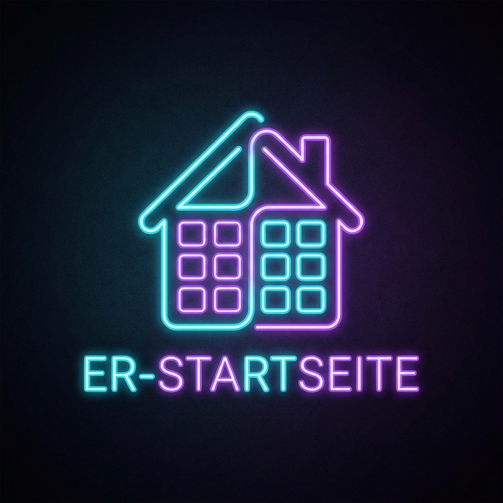

# ER-Startseite (Dashboard)



[](https://my.home-assistant.io/redirect/supervisor_addon/?addon=c1e285b7_er-dashboard)
[](https://www.home-assistant.io/addons/)
[](https://github.com/FaserF/hassio-addons/pkgs/container/hassio-addons-er-dashboard)


> A modern, highly customizable dashboard with a neon aesthetic.

---

> [!CAUTION]
> **Experimental / Beta Status**
>
> This add-on is still in development and/or primarily developed for personal use.
> It is not extensively tested yet, but is expected to work fundamentally.

---

## 📖 About

A modern, highly customizable dashboard with a neon aesthetic,
video backgrounds, and robust app integration.

ER-Startseite is a self-hosted dashboard application featuring:

- **Neon/Dark Theme**: Stunning visual design.
- **Dynamic Backgrounds**: Support for video and image backgrounds.
- **App Integration**: Add/Customize apps and widgets.

## Installation

1. Search for "ER-Startseite" in the Home Assistant Add-on Store.
2. Click **Install**.
3. Start the add-on.
4. Click **Open Web UI**.

---

## ⚙️ Configuration

Configure the add-on via the **Configuration** tab in the Home Assistant add-on page.

### Options

```yaml
certfile: fullchain.pem
keyfile: privkey.pem
ssl: false
```

---

## 👨‍💻 Credits & License

This project is open-source and available under the MIT License.
Maintained by **FaserF**.
