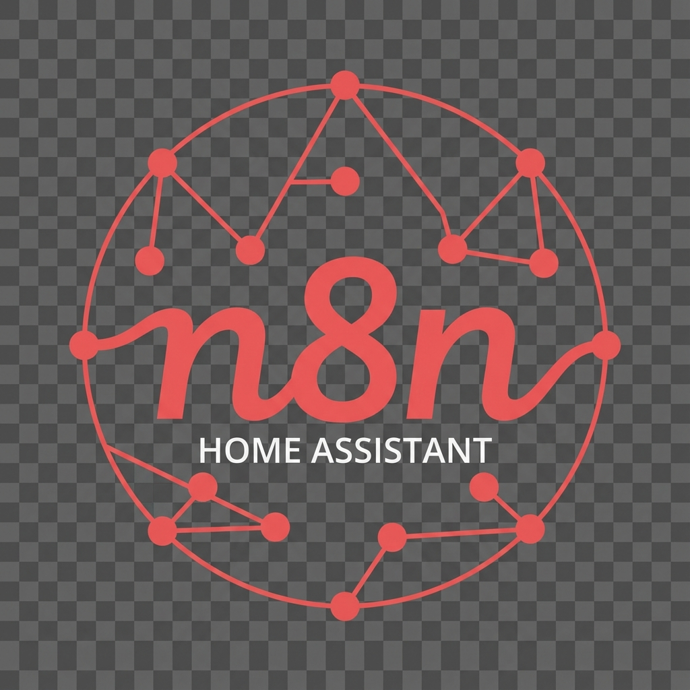

# N8n



[](https://my.home-assistant.io/redirect/supervisor_addon/?addon=c1e285b7_n8n)
[](https://www.home-assistant.io/addons/)
[](https://github.com/FaserF/hassio-addons/pkgs/container/hassio-addons-n8n)


> Workflow automation tool. N8n extends your Home Assistant with powerful workflow automation.

---

## 📖 About

> Workflow automation tool. N8n extends your Home Assistant with powerful workflow automation.

N8n (Nodemation) is an extendable workflow automation tool. With a fair-code distribution model, n8n will always have visible source code, available to self-host, and allows you to add your own custom functions, logic, and apps.

## 🐛 Report a Bug

If you encounter any issues with this add-on, please report them using the link below. The issue form will be pre-filled with the add-on information to help us resolve the problem faster.

**[Report a Bug](https://github.com/FaserF/hassio-addons/issues/new?template=bug_report.yml&addon_name=n8n&log_information=Please+paste+the+addon+log+output+here%3A%0A%0A)**

> [!NOTE]
> Please use the link above to report problems. This ensures that all necessary information (add-on name, version, etc.) is automatically included in your bug report.

## 💡 Feature Request

If you have an idea for a new feature or improvement, please use the link below to submit a feature request. The form will be pre-filled with the add-on information.

**[Request a Feature](https://github.com/FaserF/hassio-addons/issues/new?template=feature_request.yml&addon_name=n8n)**

> [!NOTE]
> Please use the link above to request features. This ensures that the add-on name is automatically included in your feature request.

---

## ⚙️ Configuration

Configure the add-on via the **Configuration** tab in the Home Assistant add-on page.

### Options

```yaml
certfile: fullchain.pem
keyfile: privkey.pem
listen_address: 0.0.0.0
log_level: info
port: 5678
ssl: false
```

---

## 👨‍💻 Credits & License

This project is open-source and available under the MIT License.
Maintained by **FaserF**.
