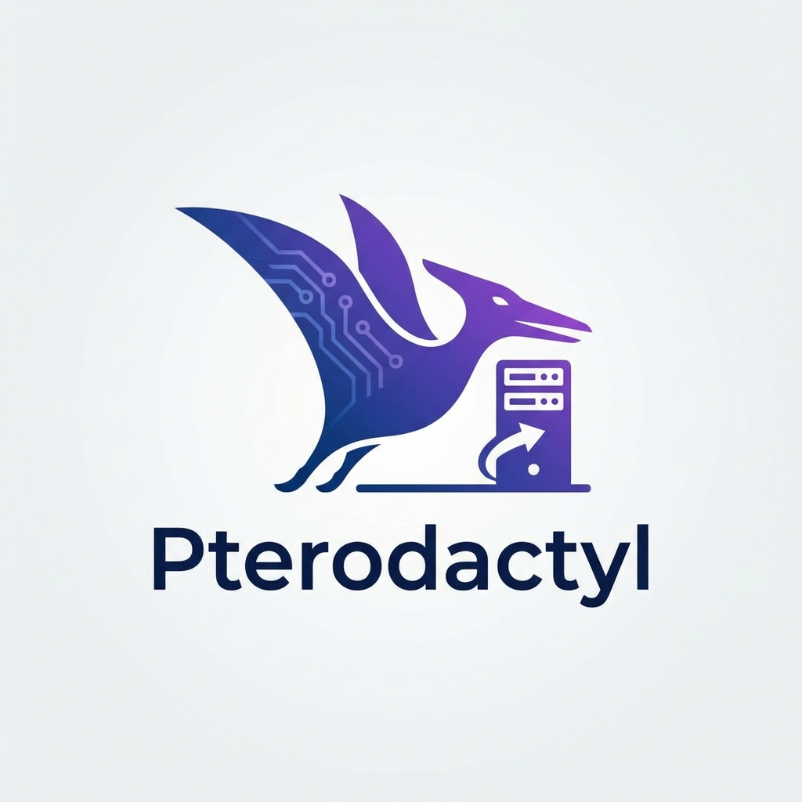

# pterodactyl Panel Gameserver - BETA

> Open-Source Gameserver - Currently not fully working

---

> [!CAUTION]
> **Experimental / Beta Status**
>
> This add-on is still in development and/or primarily developed for personal use.
> It is not extensively tested yet, but is expected to work fundamentally.

---

## 📖 About

pterodactyl Panel Gameserver for Homeassistant OS

Pterodactyl® is a free, open-source game server management panel built with PHP, React, and Go. Designed with security in mind, Pterodactyl runs all game servers in isolated Docker containers while exposing a beautiful and intuitive UI to end users.

## 📝 Documentation

For detailed information, configuration, and folder usage, please refer to the **[Documentation](DOCS.md)** (also available via the **Documentation** tab in the Home Assistant interface).

## 🚀 Installation

1. Add this repository to your **Home Assistant Add-on Store**.
1. Install the **pterodactyl Panel** add-on.
1. Configure the options.
1. Start the add-on.

---

## 👨‍💻 Credits & License

This project is open-source and available under the MIT License.
Maintained by **FaserF**.
