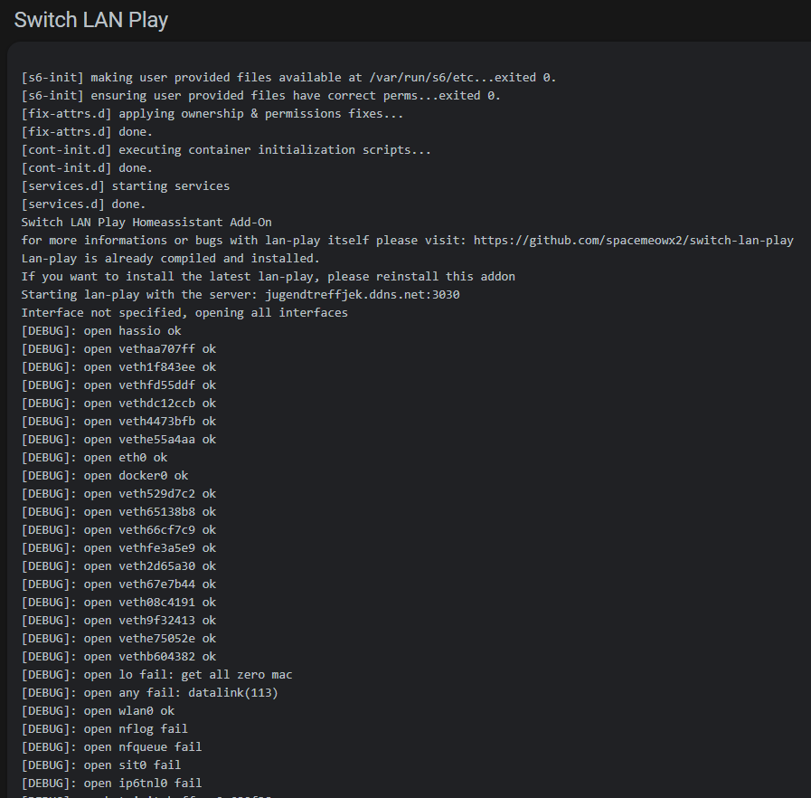

# Home Assistant Community Add-on: Switch LAN-Play
![Supports aarch64 Architecture][aarch64-shield] ![Supports amd64 Architecture][amd64-shield] ![Supports armhf Architecture][armhf-shield] ![Supports armv7 Architecture][armv7-shield] ![Supports i386 Architecture][i386-shield]
![Project Maintenance][maintenance-shield]

Nintendo Switch LAN-Play for Homeassistant OS



## About

To play with your friends, you and your friends should run lan-play client connecting to the same Server on your PC, and set static IP on your Switch.
Your PC and Switch must be connected to the same router.

This docker image will self-compile the latest lan-play software and run it based on your architecture. More information can be found here: https://drive.google.com/file/d/1A_4o8HCAfDBFsePcGL3utG-LfzMUovcx/view
The first start can take up to 10 minutes because of this! Depending on your hardware.

## Installation

The installation of this add-on is pretty straightforward and not different in comparison to installing any other custom Home Assistant add-on.
Just add my repo to the hassio addons repositorys: https://github.com/FaserF/hassio-addons

## Configuration

**Note**: _Remember to restart the add-on when the configuration is changed._

Example add-on configuration:

```yaml
server: switch.lan-play.com:11452
```

**Note**: _This is just an example, don't copy and paste it! Create your own!_

### Option: `server`

This option is mandatory. Please write here your server you want to connect to with the port added.

**Note**: If you leave this empty there will be issues.

## Changelog & Releases

This repository keeps a change log using [GitHub's releases][releases]
functionality. The format of the log is based on the original lan-play github releases added with a "-Number" for the ha addon version-

## Support

Got questions?

You could [open an issue here][issue] GitHub.
Please keep in mind, that this software is only tested on armv7 running on a Tinkerboard.

## Authors & contributors

The original program is from spacemeowx2. For more informatios please visit this github: https://github.com/spacemeowx2/switch-lan-play
The hassio addon is brought to you by [FaserF].

## License

MIT License

Copyright (c) 2019-2020 FaserF & spacemeowx2

Permission is hereby granted, free of charge, to any person obtaining a copy
of this software and associated documentation files (the "Software"), to deal
in the Software without restriction, including without limitation the rights
to use, copy, modify, merge, publish, distribute, sublicense, and/or sell
copies of the Software, and to permit persons to whom the Software is
furnished to do so, subject to the following conditions:

The above copyright notice and this permission notice shall be included in all
copies or substantial portions of the Software.

THE SOFTWARE IS PROVIDED "AS IS", WITHOUT WARRANTY OF ANY KIND, EXPRESS OR
IMPLIED, INCLUDING BUT NOT LIMITED TO THE WARRANTIES OF MERCHANTABILITY,
FITNESS FOR A PARTICULAR PURPOSE AND NONINFRINGEMENT. IN NO EVENT SHALL THE
AUTHORS OR COPYRIGHT HOLDERS BE LIABLE FOR ANY CLAIM, DAMAGES OR OTHER
LIABILITY, WHETHER IN AN ACTION OF CONTRACT, TORT OR OTHERWISE, ARISING FROM,
OUT OF OR IN CONNECTION WITH THE SOFTWARE OR THE USE OR OTHER DEALINGS IN THE
SOFTWARE.

[aarch64-shield]: https://img.shields.io/badge/aarch64-yes-green.svg
[amd64-shield]: https://img.shields.io/badge/amd64-yes-green.svg
[armhf-shield]: https://img.shields.io/badge/armhf-yes-green.svg
[armv7-shield]: https://img.shields.io/badge/armv7-yes-green.svg
[commits]: https://github.com/FaserF/hassio-switch-lan-play/commits/master
[contributors]: https://github.com/FaserF/hassio-switch-lan-play/graphs/contributors
[FaserF]: https://github.com/FaserF/
[i386-shield]: https://img.shields.io/badge/i386-yes-green.svg
[issue]: https://github.com/FaserF/hassio-switch-lan-play/issues
[releases]: https://github.com/FaserF/hassio-switch-lan-play/releases
[repository]: https://github.com/FaserF/hassio-switch-lan-play
[maintenance-shield]: https://img.shields.io/maintenance/yes/2020.svg
