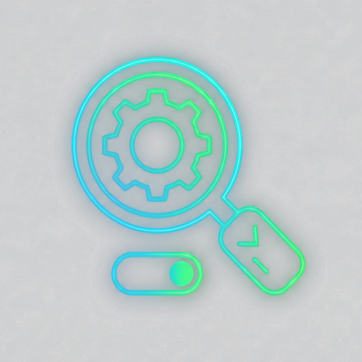

# SwitchCraft



[](https://my.home-assistant.io/redirect/supervisor_addon/?addon=c1e285b7_switchcraft)
[](https://www.home-assistant.io/apps/)
[](https://github.com/FaserF/hassio-addons/pkgs/container/hassio-addons-switchcraft)


> SwitchCraft is your powerful, cross-platform tool designed to be a comprehensive packaging assistant for IT Professionals.

---

> [!CAUTION]
> **Experimental / Beta Status**
>
> This App is still in development and/or primarily developed for personal use.
> It is not extensively testet yet, but is expected to work fundamentally.

---

## 📖 About

## Installation

1. Search for the "SwitchCraft" app in the Home Assistant App store and install it.
2. Start the "SwitchCraft" app.
3. Check the logs of the "SwitchCraft" app to see if everything went well.
4. Click "OPEN WEB UI" to access the SwitchCraft interface.

---

## ⚙️ Configuration

Configure the app via the **Configuration** tab in the Home Assistant App page.

### Options

```yaml
log_level: info
```

---

## 👨‍💻 Credits & License

This project is open-source and available under the MIT License.
Maintained by **FaserF**.
