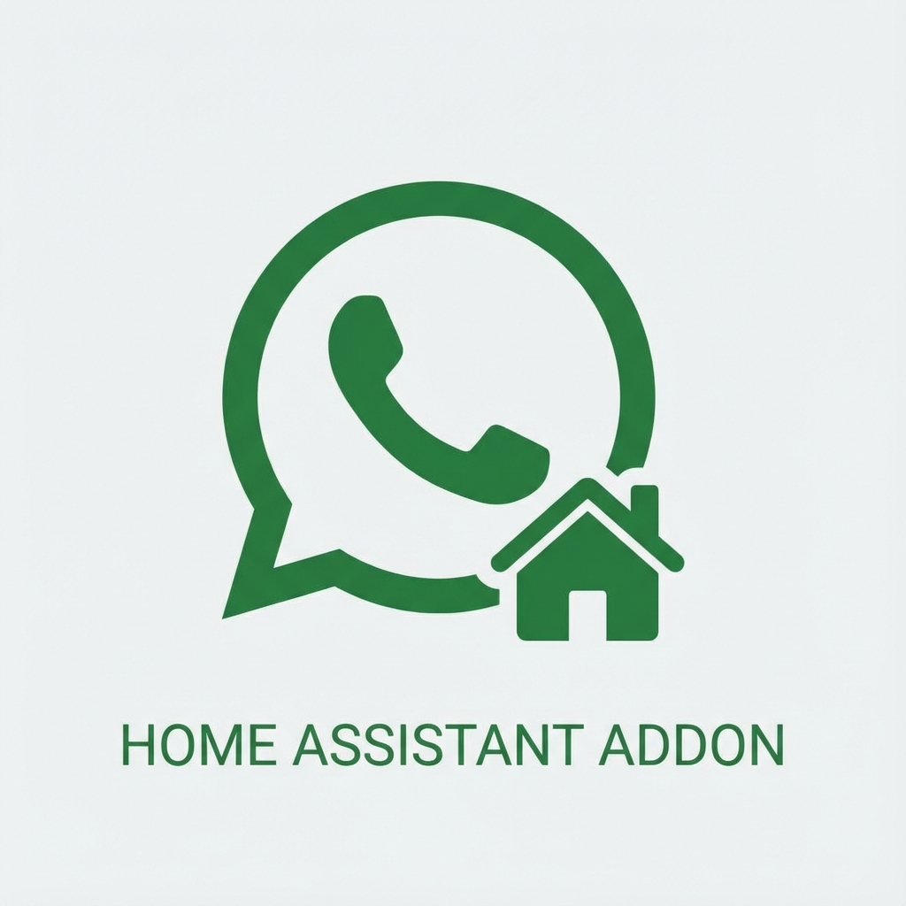

# 📱 Home Assistant WhatsApp Addon



> **A lightweight, robust backend for the WhatsApp Integration in Home Assistant.**
> Powered by [Baileys](https://github.com/WhiskeySockets/Baileys) and Node.js. 🚀

---

## 📖 About

This Addon acts as a bridge between Home Assistant and the WhatsApp Web protocol. It runs a high-performance Node.js application that simulates a real WhatsApp client (like a browser), allowing you to send messages, images, and notifications directly from your smart home.

### ✨ Key Features

- **🚀 Ultra Fast**: Built on Node.js 24 and the lightweight Baileys library
  (no heavy Chrome/Puppeteer required!).
- **🔒 Secure & Private**: Runs locally on your device. No cloud bridge, no
  external API costs.
- **💾 Persistent Session**: Stays logged in even after restarts.
- **🐳 Docker Optimized**: Platinum Quality image (S6 Overlay, Alpine Base).

---

## 🛠️ Installation

1. **Add Repository**: Add this repository to your Home Assistant Add-on Store.
1. **Install**: Search for **"WhatsApp"** and click **Install**.
1. **Start**: Click **Start**. Wait a few seconds for the logs to show "API
   listening".
1. **Watchdog**: Enable "Watchdog" to ensure high availability.

---

## ⚙️ Configuration

The addon is designed to work out-of-the-box with **zero configuration** for most users.

### Default Ports

| Service | Port   | Description                      |
|:--------|:-------|:---------------------------------|
| **API** | `8066` | Internal API for the integration |

### `config.yaml` Options

```yaml
log_level: info # Options: trace, debug, info, warning, error, fatal
```

## 🔒 Security & Dashboard (Ingress) 🛡️

This Addon is secured with a **Token** and accessible via Home Assistant **Ingress**.

1. Click **"Open Web UI"** on the Addon page.
1. The Dashboard shows:
   - **Status**: Connected 🟢 / Disconnected 🔴
   - **QR Code**: For linking your device.
   - **API Token**: Click "Show API Key" to reveal. 🔑
1. You **need this Token** to set up the Integration.

---

## 🔗 Integration Setup

Once this Addon is running:

1. Go to **Settings** > **Devices & Services**.
1. Add Integration > Search for **WhatsApp**.
1. **Host**: The setup will **auto-detect** the correct address
   (e.g. `http://7da084a7-whatsapp:8066`).
1. **API Key**: Paste the Token from the Ingress Dashboard.
1. **Scan QR**:
   - Go back to the **Ingress Web UI**.
   - Scan the QR Code with your phone (WhatsApp > Linked Devices).
   - Wait for "Device Linked ✅".

---

## ❓ Troubleshooting

### 📱 Session Reset / Re-Pairing

If you need to switch phones or fix a broken session:

1. Go to the **WhatsApp Integration** in HA.
1. Click **Configure**.
1. Check **"Reset Session (Logout)"**.
1. Submit.
   - *This clears the session in the Addon and allows you to re-scan.*

### 🛑 "Connection Failure"

- Ensure the Addon is running.
- Check if the **API Token** matches.
- Check the Addon Logs for errors.

---

## 👨‍💻 Technical Details
- **Base Image**: `ghcr.io/hassio-addons/base` (Alpine)
- **Runtime**: Node.js 24 (Alpine Edge)
- **Library**: @whiskeysockets/baileys (ESM)
- **Process Manager**: S6-RC

---

**Enjoy your smart chat automation!** 💬🏠
